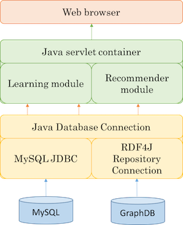

Introduction
============

APARELL stands for Active PAirwise RELations Learner, is a supervised
machine learning software which can learn a relation in OWL/Description
Logics. It implements the framework explains in this thesis.The guidance
on how to use the software is provided in this document.

Getting started
===============

APARELL is implemented in Java and can be used in almost all platform.
It requires Java version 8 or higher. It can be downloaded in the
software section in here as the main
software in a compiled “aparell.jar” file; an example of configuration
file; and a set of working examples in a folder ‘dataset’. Before
running the software, we need to prepare these three basic things, which
are:

1.  a relation name to be learned,\
    for example, we want to learn “betterthan” relationship,

2.  a set of positive and negative examples,\
    this set will contain examples in form of “individual1,individual2”
    in which individual1 is related to individual2 through a relation in
    point 1, and

3.  a class hierarchy in the ontology,\
    the class hierarchy as knowledge source is necessary to be specified
    as the learner uses it as a base to build the hypotheses.

To run the software, it requires all necessary parameters to be
specified in a configuration file stored as a text file. We will explain
the parameter configuration in the next section. The software can be
simply run from a terminal as:

    $ java -jar aparell.jar \path\to\configuration\file.txt

Configuration file
==================

There are five required parameters need to be specified in this file. It
is required to provide the full path to the specified file.

-   **kbfile** or **tripledb\_server**\
    this parameter is used to specify a knowledge source. APARELL can
    read both an OWL file and a triple database server. We need to
    specify one at a time, whether we want to use an OWL file or a
    remote/local triple store database server. All formats supporting by
    OWL API(http://owlapi.sourceforge.net) can be used in here.

-   **prefix**\
    prefix is used to reference IRI (Internationalized Resource
    Identifier) of the ontology.

-   **relation**\
    currently, APARELL can be used to learn one relation at a time. We
    need to specify the relation name in the ontology that we want to
    learn.

-   **pos\_example**\
    we need to specify the positive examples in a text file using a
    format given in the next section. The possible value is the full
    path to the positive training file.

-   **neg\_example**\
    we also need to specify the negative examples in a separated text
    file. The possible value is the full path to the negative training
    file.

There are three optional parameters can be specified in a configuration
file, they are:

-   **pos\_test**\
    we can specify the positive examples test file if we want to
    evaluate the learner model’s accuracy. The possible value is the
    full path to the positive test file.

-   **neg\_test**\
    if the positive test is specified, the negative test examples is
    also need to be specified. The possible value is the full path to
    the negative test file.

-   **literal\_depth\_limit**\
    this setting is used to limit the depth of the search with the
    default value is 4. Currently, our system can handle the search
    until the depth value=5. We can specify any positive integer number
    between 2 and 5.

-   **include\_inferred\_class** this setting is used to specify whether
    we want to include the inferred class in the search or not. The
    possible value is: YES or NO, with the default value of this setting
    is NO.

An example
==========

An example of a complete configuration file is shown in
Figure [figure:conffileexample]. All the examples, i.e. training
positive, training negative, testing positive and testing negative, is
using the format shown below as the pairs of
`individual - individual` separated by a comma. All the input files is
stored as textfiles.


A sample of a configuration file:
```
% knowledge base resource
% tripledb_server=http://localhost:7200/repositories/mycarsontology
kbfile = car.owl
prefix = http://www.mycars.org/ontology#
relation = betterthan

% training examples
pos_examples = trainpos.txt
neg_examples = trainneg.txt

% test examples (optional)
pos_test = testpos.txt
neg_test = testneg.txt

% parameter settings (optional)
literal_depth_limit=3
include_inferred_class=no
```
A sample of a positive examples file:
```
car7,car6
car7,car8
car3,car1
car2,car3
```


Software architecture
=====================

APARELL is built by using two types of Java ontology handling library:
OWL API for processing an OWL file and RDF4J for processing an ontology
from an RDF database server. For the ability to read databases from a
remote server, this software works well with GraphDB (https://ontotext.com/products/graphdb/). 
APARELL’s system architecture is shown in Figure below.




